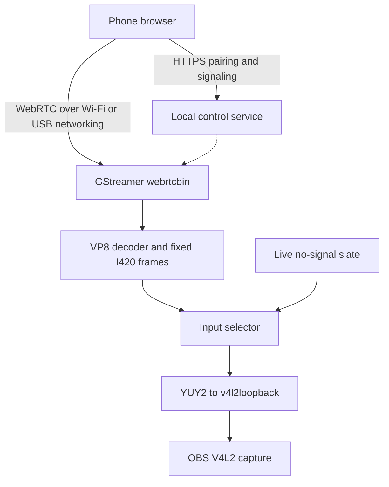

> **Maintainer update:** primary target is now **Ubuntu + Samsung Smart View**, ahead of USB. See [Smart View setup/status](smartview-ubuntu.md). The MiracleCast receiver prototype is integrated but physical Galaxy/P2P acceptance remains open; USB is a fallback. Earlier Fedora/USB rollout references below are historical context.

# Current architecture: V2 receiver-first

[Architecture v2](architecture-v2.md) is the current decision. [Migration audit](receiver-audit.md) describes the reference implementation and open hardware gates. The browser/WebRTC architecture below is retained V1 context.

---

# Phase 0 architecture

The native Rust window supervises the reference service through a child process. Its stdout is a private JSON event channel for readiness, a pairing URL and diagnostics; no HTTP request access log is enabled. GTK is updated only on its main thread.

The reference service owns HTTPS authentication/signaling and a GLib worker for GStreamer. WebRTC uses no ICE servers. The static asset router serves an explicit whitelist rather than the project directory.

One loopback writer stays open for the lifetime of the host. Decoded video and the no-signal source feed an input selector; session teardown switches to the slate before removing the old receiver. Source changes re-open a phone session rather than relying on unverified renegotiation. A stalled input selects the slate after three seconds.

Source capture presets are separate from the host's fixed output format. Receiving a 1080p camera source with a 720p host configuration still produces a 720p V4L2 output. VP8 software decoding is the compatibility baseline; zero-copy/hardware decode is not claimed.

## Next engineering gate

Validate the exact SDP/ICE, timestamps, selector transitions and output caps on Fedora before extending the pipeline or migrating it to Rust. Native live preview, automatic interface detection, metrics for packet loss/queue delay and mobile ML remain subsequent work.

References: [GStreamer webrtcbin](https://gstreamer.freedesktop.org/documentation/webrtc/), [input-selector](https://gstreamer.freedesktop.org/documentation/coreelements/input-selector.html), [v4l2loopback](https://github.com/v4l2loopback/v4l2loopback).
